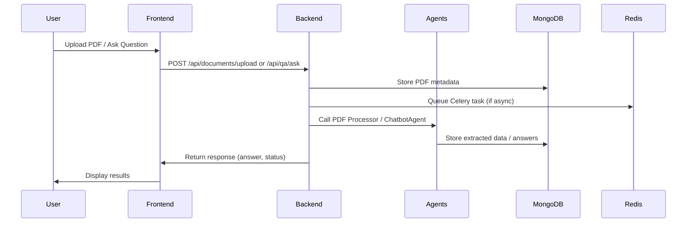

# Backend + Frontend Integration Architecture Plan (Vertical Slice)

---

## 1. Environment Setup

- Create `.env` files for backend and frontend with all API keys (Gemini, Quasar, etc.), MongoDB URI, Redis URL.
- Ensure `Config` class loads all keys and URIs.
- Use virtual environments for Python dependencies.

---

## 2. Backend Enhancements (Vertical Slice)

- **Adopt `vertical_slice_app.py` as the main backend app.**
- **Migrate API endpoints and agent integrations into feature-specific Blueprints:**
  - **Upload Blueprint:** `/api/documents/upload`
  - **Q&A Blueprint:** `/api/qa/ask`
  - **Financial Blueprint:** `/api/financial/extract`
  - **Reports Blueprint:** `/api/reports/generate`
- **Initialize all agents (ChatbotAgent, FinancialAgent, QueryAgent, ReportAgent) within their respective Blueprints.**
- **Pass API keys via `Config`.**
- **Use Celery with Redis for async PDF processing and financial extraction.**
- **Store PDFs, extracted data, chat history in MongoDB.**

---

## 3. Frontend Enhancements (DevDocs)

- **Connect upload form to `/api/documents/upload`.**
- **Connect Q&A interface to `/api/qa/ask`.**
- **Display extraction and report results.**
- **Use `.env.local` to set backend API URL.**
- **Use Playwright to test upload, Q&A, and result display flows.**

---

## 4. Testing

- **Backend:**
  - Use Pytest for API and agent tests.
  - Add integration tests for upload + processing + Q&A.
- **Frontend:**
  - Use Playwright for end-to-end tests.
- **Continuous Integration:**
  - Set up GitHub Actions or similar to run tests on push.

---

## 5. Monitoring & Debugging

- **Redis:** Monitor Celery queues and cache.
- **MongoDB:** Monitor data storage and retrieval.
- **Logging:** Add logs for agent calls, API usage, errors.
- **MCPs:** Use Redis MCP to inspect runtime data, Brave Search MCP for troubleshooting.

---

## 6. Optional Enhancements

- **GitHub Repos:** Integrate open-source PDF parsers, NLP models, or chatbot frameworks.
- **Cloud Deployment:** Use Docker Compose or Kubernetes for local dev and cloud. Deploy on AWS Elastic Beanstalk or Lightsail.

---

## 7. Data Flow Diagram

---

## Summary

- Use **vertical slice architecture** for modular, maintainable backend.
- Connect **DevDocs frontend** to backend REST APIs.
- Integrate **agents** via Blueprints.
- Use **Celery + Redis** for async processing.
- Store data in **MongoDB**.
- Securely load **API keys**.
- Add **testing and monitoring**.
- Plan for **cloud deployment**.